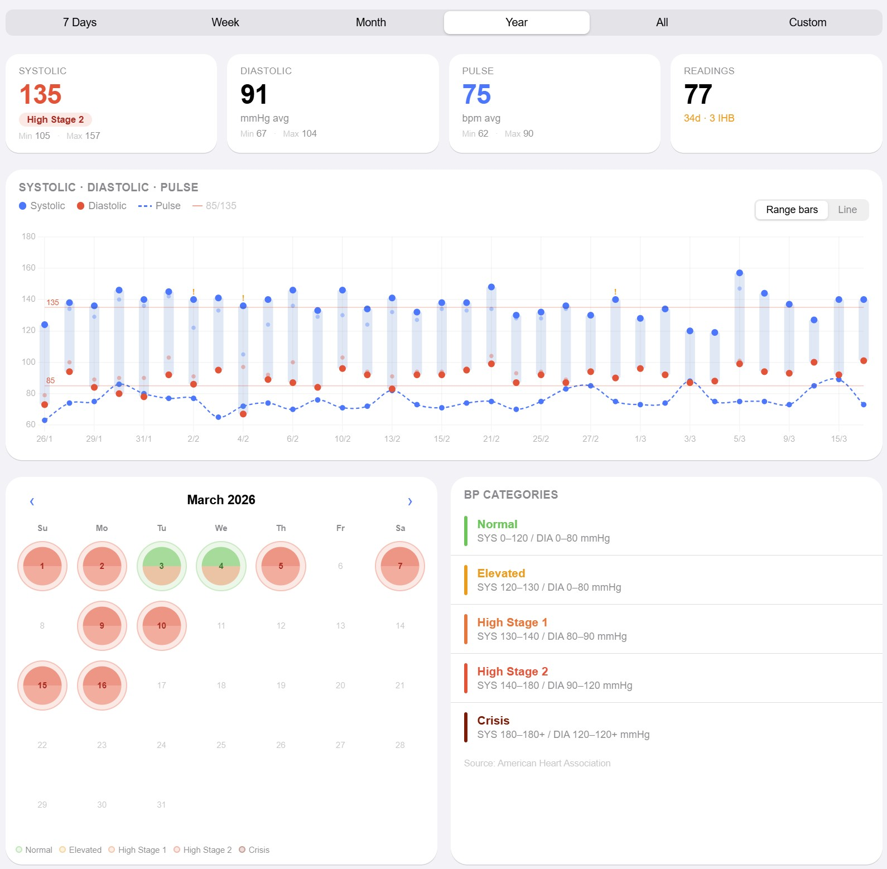

# Blood Pressure Analysis Dashboard

A fully client-side, privacy-first dashboard for analysing blood pressure readings exported from the **OMRON Connect** mobile app.

All processing happens locally in the browser — **no accounts, no servers, no data ever leaves your device**

---

## Features

- 📊 **Daily range chart** — systolic/diastolic min–max bars with pulse overlay
- 📈 **Line chart** — individual readings plotted over time
- 🗓️ **Colour-coded calendar** — at-a-glance monthly heatmap per AHA category
- 🏷️ **Category badges** — Normal / Elevated / High Stage 1 / High Stage 2 / Crisis
- 🔍 **Filter & paginate** — filter readings by category, show 10/25/50/all per page
- 📆 **Flexible time periods** — 7 days, week, month, year, all time, or custom range
- 🌙 **Dark mode** — automatic via `prefers-color-scheme`
- 📱 **Responsive** — works on mobile, tablet and desktop



---

## Getting Started

### Option A — Open directly in a browser

Because the dashboard uses only plain HTML, CSS and JavaScript with no build step required, you can open `index.html` directly:

```bash
open index.html          # macOS
start index.html         # Windows
xdg-open index.html      # Linux
```

> **Note:** Some browsers restrict `FileReader` when using the `file://` protocol.
> If drag-and-drop doesn't work, use Option B.

### Option B — Serve locally

Any static file server will work:

```bash
# Python 3
python -m http.server 8080

# Node.js (npx)
npx serve .

# VS Code
# Install the "Live Server" extension, then right-click index.html → Open with Live Server
```

Then visit `http://localhost:8080`.

---

## Usage

1. Export your blood pressure data from the **OMRON Connect** app as a CSV file.
2. Open the dashboard and either:
   - Click **Upload** in the navbar, or
   - Drag and drop the `.csv` file anywhere on the page.
3. Use the period selector (7 Days / Week / Month / Year / All / Custom) to filter the view.
4. Tap a calendar cell to see individual readings for that day.

---

## CSV Format

The parser auto-detects column positions by keyword matching on the header row.
The following columns are used (case-insensitive):

| Column header (partial match) | Required |
|-------------------------------|----------|
| `Measurement Date`            | ✅       |
| `SYS(mmHg)`                   | ✅       |
| `DIA(mmHg)`                   | ✅       |
| `Pulse(bpm)`                  | Optional |
| `Irregular heartbeat detected`| Optional |

Extra columns (Timezone, temperature, mode, device, etc.) are ignored.

---

## Project Structure

```
/
├── index.html              # Entry point — markup + script loading order
├── css/
│   └── styles.css          # All styles (design tokens, components, responsive)
├── js/
│   ├── categories.js       # AHA BP category definitions + getCategory()
│   ├── csv-parser.js       # OMRON CSV parser
│   ├── state.js            # Application state + utility helpers
│   ├── charts.js           # Chart.js range-bar and line chart builders
│   ├── ui.js               # DOM rendering (stats, calendar, modal, readings)
│   └── file-loader.js      # File input + drag-and-drop handlers
├── images/
│   └── screenshot.jpg      # Sample screenshot image
└── README.md
```

### Script loading order

Scripts must be loaded in dependency order (see bottom of `index.html`):

```
categories → csv-parser → state → charts → ui → file-loader
```

---

## Blood Pressure Categories

Based on the [American Heart Association](https://www.heart.org/en/health-topics/high-blood-pressure/understanding-blood-pressure-readings) guidelines:

| Category      | Systolic (mmHg) | Diastolic (mmHg) |
|---------------|-----------------|------------------|
| Normal        | < 120           | < 80             |
| Elevated      | 120–129         | < 80             |
| High Stage 1  | 130–139         | 80–89            |
| High Stage 2  | ≥ 140           | ≥ 90             |
| Crisis        | ≥ 180           | ≥ 120            |

---

## Browser Support

Requires a modern browser with support for:

- CSS custom properties
- `FileReader` API
- `canvas` element
- `backdrop-filter` (decorative only; gracefully degrades)

Tested in: Chrome 120+, Firefox 121+, Safari 17+, Edge 120+.

---

## Dependencies

| Library   | Version | Source  | Usage                     |
|-----------|---------|---------|---------------------------|
| Chart.js  | 4.4.1   | cdnjs   | Range-bar and line charts |

No build tools, no npm, no bundler required.

---

## Privacy

All data is processed entirely in your browser using the `FileReader` API.
Nothing is sent to any server. There is no analytics, no tracking, and no
external requests beyond loading Chart.js from cdnjs.

---

## Disclaimer

This dashboard is a personal health-data visualisation tool and is **not** a
medical device. Always consult a qualified healthcare professional regarding
your blood pressure readings.

---

## Attributions

Code was generated using [Claude](https://claude.ai/chat)
Inspired by [Vpnry](https://github.com/vpnry/visualize-blood-pressure)